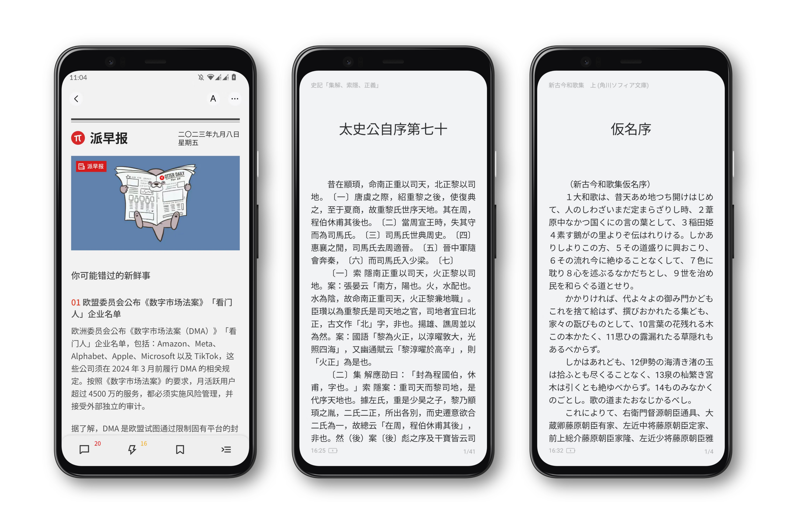

# ChiuKongGothic-Magisk：秋空黑體 Magisk 模块

本项目的 **Magisk 字体模块**修改自 [@lxgw](https://github.com/lxgw) 提供的 [CJK 字体 Magisk 模块模板简易版](https://github.com/lxgw/simple-cjk-font-magisk-module-template)，适配了最新的 Android 13 字体配置文件。

有关套用模板的介绍和原理，请看：[为 Android 换上任意喜欢的字体，你可以试试这个 Magisk 模块（少数派）](https://sspai.com/post/58049)

## 关于字体

- 使用[秋空黑體](https://github.com/ChiuMing-Neko/ChiuKongGothic)作为汉字、注音、假名、谚文（`zh-Hans`、`zh-Hant`、`zh-Bopo`、`ja`、`ko`）的主要字体，呈现具有传统中文印刷风格的旧字形。
- 使用[思源黑体](https://github.com/adobe-fonts/source-han-sans)补充显示秋空黑體中缺少的简化字，使用[遍黑体](https://github.com/Fitzgerald-Porthmouth-Koenigsegg/Plangothic-Project)显示超集汉字，整体风格统一，优雅地提供思源旧字形体验。
- 遍黑体项目仍在不断完善，缺字会显示为花園明朝體，本模块也会不断跟进遍黑体的更新。
- 模块所使用的秋空黑體对标点做了一些调整，将居中的标点沉底，更适合横排的移动设备环境。若需要居中标点，将 `/system/fonts` 下的 `ChiuKongGothic-CL-w*.otf` 文件替换为原版秋空黑體即可。字体文件名与字重对应关系如下：

| 显示字重 | 字体文件                 | 字体字重   |
| -------- | ------------------------ | ---------- |
| 100      | ChiuKongGothic-CL-w2.otf | ExtraLight |
| 200      | ChiuKongGothic-CL-w2.otf | ExtraLight |
| 300      | ChiuKongGothic-CL-w3.otf | Light      |
| 400      | ChiuKongGothic-CL-w4.otf | Regular    |
| 500      | ChiuKongGothic-CL-w5.otf | Medium     |
| 600      | ChiuKongGothic-CL-w5.otf | Medium     |
| 700      | ChiuKongGothic-CL-w7.otf | Bold       |
| 800      | ChiuKongGothic-CL-w7.otf | Bold       |
| 900      | ChiuKongGothic-CL-w9.otf | Heavy      |

## 使用方法

1. 设备需要安装 Magisk。
2. 在 [Release](https://github.com/Tseing/ChiuKongGothic-Magisk/releases/latest) 界面下载 zip 格式的模块 **ChiuKongGothic-Magisk-{version}.zip**。
3. 用任意方式将压缩文件转移到手机，存储至方便定位的目录下，例如 `/sdcard/Download`。
4. 打开 Magisk，选择 **模块-从本地安装**，点选 `ChiuKongGothic-Magisk-{version}.zip`，完成安装后按提示重启设备即可应用。

## 字重测试

[点击此处进入字重测试](https://font.yukonga.top/) （酷安 [@YuKongA / 原名「余空_YuK」](https://www.coolapk.com/u/680367) 制作提供）

## 注意事项

1. `/system/fonts` 目录内的 **EmptyFont** 为空字体文件，为 Android 默认西文字体 Roboto 的掏空字体，主要提供度量和字重信息，**请勿轻易删除。** *（灵感来自 [极限社区](http://bbs.themex.net) RadarNyan，这个网站已经进不去了。）*
2. `/system/etc/fonts.xml` 为字体配置文件，由 Android 13 原生系统中提取并加以修改，在 LineageOS 20（Android 13）上测试正常。
3. **本模块模板最低支持 Magisk 20.4。**
4. 想要更加高级的自定义模板，可参阅 [高级版字体模块模板](https://github.com/lxgw/advanced-cjk-font-magisk-module-template)，可自行搭配西文、中文、日文和韩语字体，同样支持 9 个字重。

## 感谢

- [@lxgw](https://github.com/lxgw) 提供的 [CJK 字体 Magisk 模块模板简易版](https://github.com/lxgw/simple-cjk-font-magisk-module-template)
- [思源黑体](https://github.com/adobe-fonts/source-han-sans)
- [秋空黑體](https://github.com/ChiuMing-Neko/ChiuKongGothic)
- [遍黑体](https://github.com/Fitzgerald-Porthmouth-Koenigsegg/Plangothic-Project)